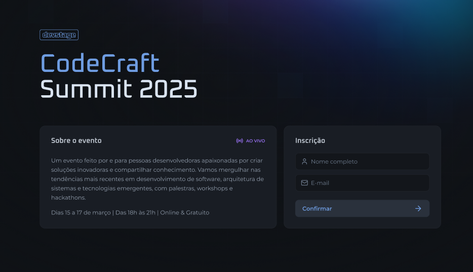

# DevStage Referral System



## Description

This project is a referral system for a DevStage event. It allows users to register for the event and share a unique link to invite others. The system tracks referrals and displays a ranking of participants who have brought in the most new registrations.

This project utilizes Redis for user ranking, leveraging functions such as `HINCRBY`, `ZREVRANGE`, `ZSCORE`, and `ZINCRBY` to efficiently manage and retrieve ranking data in real time.

## Technologies Used

- **Front-end**: React.js, Next.js, Tailwind CSS
- **Back-end**: Node.js, Fastify
- **Database**: PostgreSQL Redis
- **Other**: Docker, Docker Compose

## Installation

### Backend Setup

1. Navigate to the backend folder:
   ```sh
   cd backend
   ```
2. Install dependencies:
   ```sh
   npm install
   ```
3. Configure environment variables by copying `.env.example` to `.env` and updating the values as needed.
4. Start Docker services:
   ```sh
   docker-compose up -d
   ```
5. Start the backend server:
   ```sh
   npm run dev
   ```
   The backend will be running at `http://localhost:3333`.

### Frontend Setup

1. Navigate to the frontend folder:
   ```sh
   cd frontend
   ```
2. Install dependencies:
   ```sh
   npm install
   ```
3. Start the frontend server:
   ```sh
   npm run dev
   ```
   The frontend will be running at `http://localhost:3000`.
